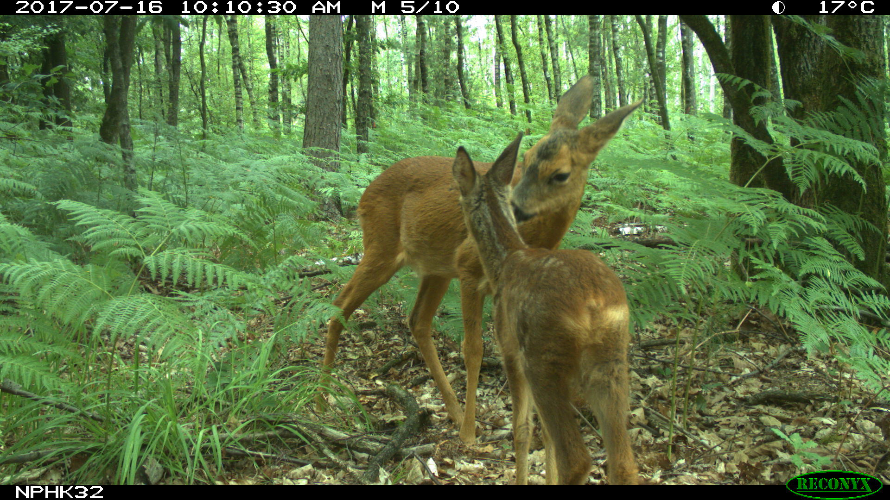

# Cameratrap observations exercise

Welcome!

Tomorrow you have to report to the project partners the preliminar results of the camera trap study at Hoge Kempen, in collaboration with UHasselt. 

The annotations of the photos were done using the [Agouti camera trap management tool](https://www.agouti.eu/) and an export of the database containing the observations has been provided to you as a file [`observations.csv`](data/observations.csv). The data file contains information about the moment of the observation/photo(s) (`observationTimestamp`), the animal on the photo (`animal*`, e.g. `animalVernacularName`, `animalCount`,...) and the deployment of the camera, i.e. the period (`deploymentStart`/`deploymentEnd`) and location (`deploymentLatitude`/`deploymentLongitude`) of the camera.

In order to do to, you have to provide the following outputs:

1. An update on the occurrences for each species. Create a bar chart with the total number of individuals counted for each species. 

2. Create a map based on the [`EUgrid10.geojson`](data/EUgrid10.geojson) GIS vector file to report the counts for each UTM 10 grid cell. In the output map, the color of each cell represents the overal counts of observatioins in the respective grid cell. Maybe [this](https://gist.github.com/stijnvanhoey/7b51017718834f150f781a256292904e) could help...

3. Put both outputs together in a single report file and briefly discuss the results of this analysis.

Try to do as much as possible within the given time limit. Use the tools and knowledge you already have to solve the assignments. If some elements do not work, try to describe how you would tackle it if more time or other tools would have been available. 
In case you would have time left, impress us! We like clever insights about our data, interactive maps and plots,...

If you would write any code, put your R or Rmd scripts in the `src` folder. 

We wish you all the best!

